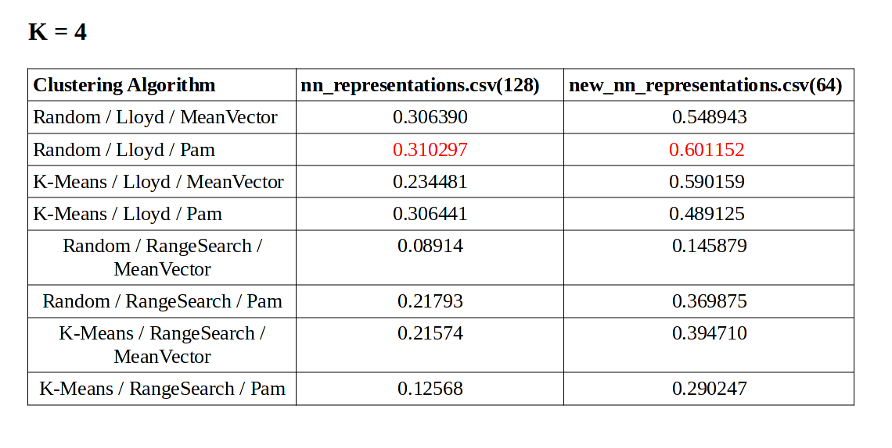
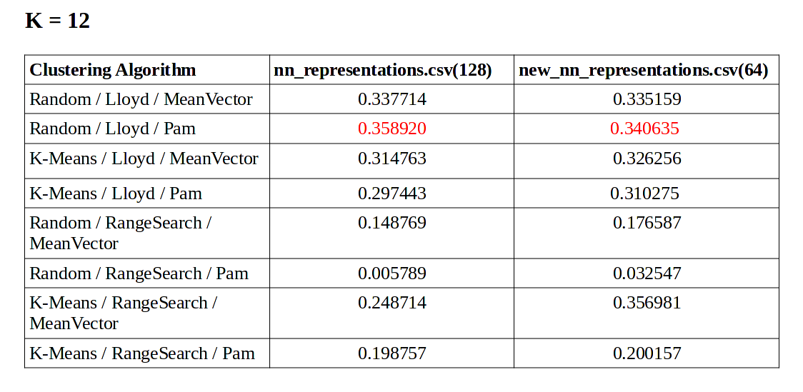

# Contributors
 - Qwerkykk
 - ioannakarageorgou
 
 
# About

In this project we implemented clustering algorithms with a pre-trained model to predict wind speed.
For the clustering we used many pairs of algorithms for Initialization/Assignment/Update to find which one is the optimal combination.
As you can see from the tables below we found that the best combination for clustering our data is Random Selection Initialization -  Lloyd’s Assignment – PAM `a la Lloyds Update,
with better results using vectors with 64 dimensions and clustering by season (K=4)

